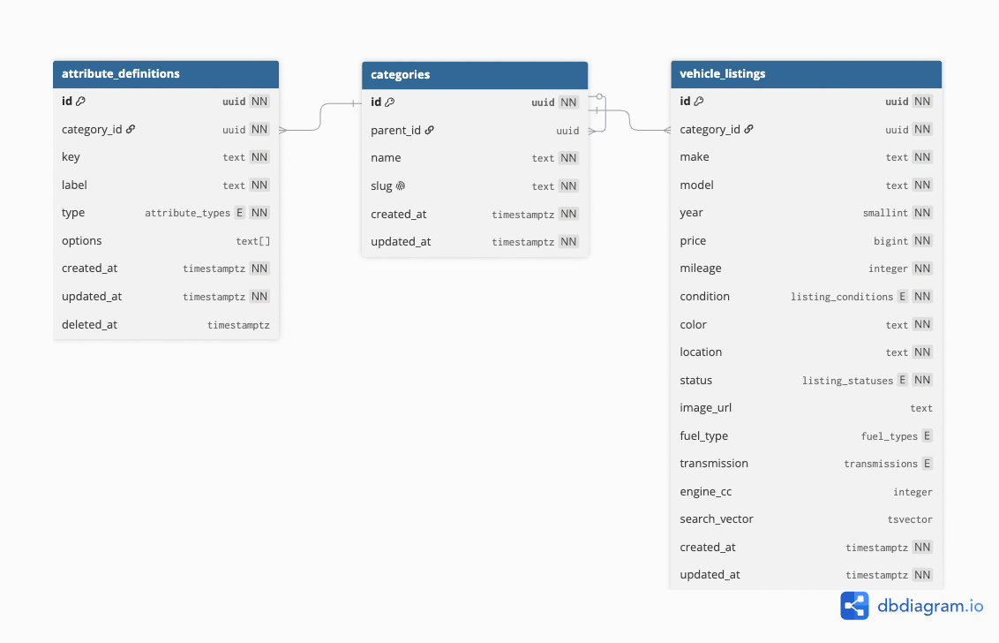

# Automotive Marketplace API

A REST API for an automotive marketplace. Sellers can create and manage vehicle listings. Buyers can browse listings by category, filter them, and search by make, model, or location.

The project focuses on relational schema design, category and filter behavior, search performance, API behavior, and code organization. The current implementation and its limits are described in [the architecture guide](docs/ARCHITECTURE.md).

## Live API

**Base URL:** [automotive-marketplace-api-rouge.vercel.app](https://automotive-marketplace-api-rouge.vercel.app/)

Open the [production API documentation](https://automotive-marketplace-api-rouge.vercel.app/docs), the [OpenAPI JSON](https://automotive-marketplace-api-rouge.vercel.app/docs/json), or the [health check](https://automotive-marketplace-api-rouge.vercel.app/health-check). Deployment steps and smoke checks are in [the deployment guide](docs/DEPLOYMENT.md).

## API Documentation

- [Local Swagger UI](http://localhost:8080/docs) when running locally
- [Local OpenAPI JSON](http://localhost:8080/docs/json) when running locally

The OpenAPI document is generated from the route schemas and documents the API endpoints, request parameters, and response shapes.

## What the API Supports

- Create, read, update, and remove vehicle listings.
- Create and update categories, then browse their nested tree.
- Browse listings by category, including its descendant categories.
- Filter by category, make, model, condition, fuel type, transmission, price, year, mileage, and location.
- Search listing text and request make, model, or location suggestions.
- Continue listing pages with cursors and choose a supported sort order.

The current API does not model seller accounts or listing ownership. Listing and category write routes are public. The deployment applies rate limits, but authorization is needed before accepting writes from real sellers.

## Requirements

- [Bun](https://bun.sh/)
- Docker with Docker Compose, for the containerized setup

Install the locked dependencies when running the API from your host:

```bash
bun install --frozen-lockfile
```

## Configuration

Copy the example file before starting the services:

```bash
cp .env.example .env
```

`.env.example` contains local development values and placeholder credentials. Do not put real credentials in it or commit `.env`.

| Variable | Purpose |
| --- | --- |
| `NODE_ENV` | Runtime mode. The local example uses `development`. |
| `PORT` | API port. Defaults to `8080`. |
| `LOG_LEVEL` | Log level: `debug`, `info`, `warn`, or `error`. |
| `DATABASE_URL` | PostgreSQL connection used by the API and, by default, migrations. |
| `DATABASE_URL_UNPOOLED` | Optional direct database URL. Migrations and seeding prefer it when set. |
| `REDIS_BACKEND` | `tcp` for local Redis or `upstash` for Upstash Redis. |
| `REDIS_URL` | TCP Redis URL used for local development. |
| `UPSTASH_REDIS_REST_URL` | Required with the `upstash` backend. |
| `UPSTASH_REDIS_REST_TOKEN` | Required with the `upstash` backend. |
| `POSTGRES_USER`, `POSTGRES_PASSWORD`, `POSTGRES_DB` | PostgreSQL container settings. |
| `POSTGRES_HOST`, `POSTGRES_PORT` | Host connection settings used by the local example. |
| `REDIS_HOST`, `REDIS_PORT` | Host connection settings used to build the local Redis URL. |

The Compose setup replaces the host names with its service names. For Vercel, use the variables listed in [the deployment guide](docs/DEPLOYMENT.md).

## Run Locally

### Containerized Development

Start the API, PostgreSQL, and Redis:

```bash
bun run docker:up
```

In a second terminal, apply the schema and load demo data:

```bash
bun run migrate:up
bun run seed
```

The Compose command stays attached to the terminal. Stop it with `Ctrl+C`, or run `bun run docker:down` from another terminal. Docker volumes keep the database and Redis data between runs. Run `bun run docker:up` again after source changes to rebuild the API image.

### Bun Server with Docker Services

Use this option to run the API on your host while PostgreSQL and Redis run in Docker:

```bash
docker compose -f docker-compose.dev.yml up -d postgres redis
bun install --frozen-lockfile
bun run migrate:up
bun run seed
bun run dev
```

If the containerized API is already running, stop it first to free the API port. The host `.env` uses `127.0.0.1`; containers use the Compose service names. Change `PORT`, `POSTGRES_PORT`, or `REDIS_PORT` in `.env` if those host ports are in use.

The API defaults to `http://localhost:8080`:

- Health check: `http://localhost:8080/health-check`
- Swagger UI: `http://localhost:8080/docs`
- OpenAPI JSON: `http://localhost:8080/docs/json`

## Migrations and Demo Data

Apply migrations with:

```bash
bun run migrate:up
```

Migration files live in `migrations/` as matching `.up.sql` and `.down.sql` files. To revert the latest migration, run `bun run migrate:down`.

Seed the database with:

```bash
bun run seed
```

The seed creates 500 repeatable listings across nine vehicle categories in a 10-category tree, along with category attribute definitions. Running it again updates those demo records instead of creating another set. Seeding and migrations use `DATABASE_URL_UNPOOLED` when set, otherwise `DATABASE_URL`.

## API Overview

| Method | Path | Description |
| --- | --- | --- |
| `GET` | `/health-check` | Check application, PostgreSQL, and Redis health. |
| `GET` | `/categories` | Return the nested category tree. |
| `GET` | `/categories/:id` | Return a category, active attribute definitions, and direct children. |
| `GET` | `/categories/:id/listings` | Browse available listings in a category subtree. |
| `POST` | `/categories` | Create a root category or child category. |
| `PATCH` | `/categories/:id` | Update a category or its attribute definitions. |
| `GET` | `/filters` | Return catalog-wide filter counts and ranges. |
| `GET` | `/filters/:categoryId` | Return filters for a category subtree. |
| `GET` | `/listings` | Browse available listings with filters, make facets, and cursor pagination. |
| `GET` | `/listings/:id` | Return one listing unless it has been removed. |
| `POST` | `/listings` | Create a listing in an existing category. |
| `PATCH` | `/listings/:id` | Update fields on an existing listing. |
| `DELETE` | `/listings/:id` | Mark a listing as removed. |
| `GET` | `/listings/search` | Search available listings with text and structured filters. |
| `GET` | `/listings/search/suggest` | Return prefix suggestions for makes, models, or locations. |

The Swagger UI linked in [Live API](#live-api) documents endpoint parameters and schemas. For `/listings`, range filters use names such as `min_price` and `max_year`. `/listings/search` uses `price_min` and `year_max` instead. Both endpoints return a `next_cursor` for the following page.

## Schema Diagram

**Interactive diagram:** [View the schema in dbdiagram.io](https://dbdiagram.io/d/Automotive-Marketplace-6ab3a31658694256126ee4bc). The editable [DBML source](docs/schema.dbml) is also in this repository.



## Architecture

The code separates HTTP controllers, application services, domain types and policies, and PostgreSQL repositories. The main container wires those parts together. PostgreSQL stores categories, listings, and category attribute definitions; Redis caches selected reads and provides deployed rate limiting.

Fields used for listing filters and search are stored in typed relational columns. Categories use a parent reference, and recursive queries include descendant listings. Category attribute definitions describe available filters, but arbitrary per-listing attribute values are not stored. The [DBML schema](docs/schema.dbml) is the source for the ER diagram.

The architecture guide explains code boundaries, category-tree behavior, search queries, indexes, pagination, request flow, and current trade-offs. The database diagram link is above.

## Deployment

See [Deploy to Vercel](docs/DEPLOYMENT.md) for Neon and Upstash setup, environment variables, migration steps, and deployment checks. The [Live API](#live-api) section has the public base URL and links to check after each deployment.
