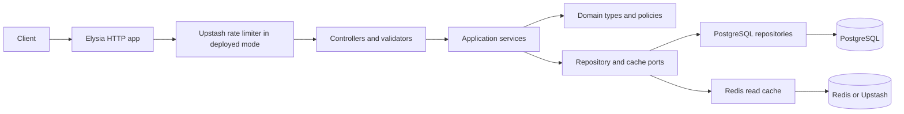

# Architecture

## Purpose and Scope

This service exposes a REST API for vehicle categories, listings, filters, and search. It uses PostgreSQL as the system of record and Redis for selected read caching. The HTTP layer runs in Docker for local development and on Vercel for deployment.

The current API has no seller accounts, listing ownership, or authorization. Listing and category write routes are public. Price values have no currency marker. These limits matter before using the service with real sellers or prices from more than one currency.

The relational schema for the ER diagram is kept separately in [schema.dbml](schema.dbml). This guide focuses on request flow and the choices that shape category, search, and listing queries.

## System at a Glance



`src/main/container.ts` wires the services to PostgreSQL repositories and the Redis cache. Controllers validate requests, call application services, and shape responses through presenters. A shared error handler maps validation, domain, and unexpected errors to the API response format.

## Code Organization

### Repository Layout

```text
.
├── docs/                         # Architecture, deployment, and DBML documentation
├── migrations/                   # Reversible PostgreSQL schema migrations
├── scripts/                      # Database seed scripts
├── src/
│   ├── application/
│   │   ├── ports/                 # Interfaces for persistence and caching
│   │   ├── service/               # Listing, search, category, and filter use cases
│   │   └── utils/                 # Shared application helpers
│   ├── domain/
│   │   ├── entities/              # Category and listing domain types
│   │   ├── errors/                # Domain errors
│   │   └── policies/              # Category rules and policies
│   ├── infrastructure/
│   │   ├── logging/               # Logging and request trace context
│   │   ├── postgres/              # PostgreSQL client, health, query timing, and migrations
│   │   └── redis/                  # Redis clients, cache, and health checks
│   ├── interface/
│   │   ├── controllers/           # HTTP routes
│   │   ├── http/                  # HTTP response and cache helpers
│   │   ├── middleware/            # Request context, logging, errors, and rate limits
│   │   ├── presenters/            # Domain-to-JSON response mapping
│   │   └── validators/            # Request and response schemas
│   ├── main/
│   │   ├── config/                # Environment configuration
│   │   └── container.ts           # Dependency wiring
│   └── repository/postgres/       # PostgreSQL implementations of application ports
├── server.ts                      # Runtime entry point
└── docker-compose.dev.yml         # Local API, PostgreSQL, and Redis services
```

The directories follow the direction of the request flow: the interface calls application services, which depend on ports and domain rules. PostgreSQL repositories implement those ports. Infrastructure contains the database and Redis clients and operational helpers. This keeps HTTP and persistence details outside the application and domain rules.

| Directory | Responsibility |
| --- | --- |
| `src/interface/controllers/` | HTTP routes and status codes. |
| `src/interface/validators/` | Request and response schemas used by Elysia and the generated OpenAPI document. |
| `src/interface/middleware/` | Request context, logging, error handling, and rate limiting. |
| `src/interface/presenters/` | Convert domain values into JSON response shapes. |
| `src/application/service/` | Listing, search, category, and filter use cases. |
| `src/application/ports/` | Interfaces the application uses for persistence and caching. |
| `src/domain/` | Listing and category types, domain errors, and category policies. |
| `src/repository/postgres/` | PostgreSQL implementations of the application ports. |
| `src/infrastructure/` | PostgreSQL, Redis, logging, health checks, and migrations. |
| `src/main/` | Environment loading, dependency wiring, and server setup. |

The request path is HTTP route to validator to application service to port implementation. The service depends on port interfaces, so the PostgreSQL and Redis clients stay outside the domain and application rules.

## Category Tree and Filters

Categories use an adjacency list: each row has an optional `parent_id` referencing another category. A recursive CTE builds the full tree and expands a category to its descendants when listing results are scoped to a category. The API returns the tree with child categories sorted by name and then ID. The tree query detects categories that are unreachable from a root, which exposes cycles in the stored hierarchy.

Attribute definitions belong to one category and have an `ENUM`, `RANGE`, or `BOOLEAN` type. Active definitions have unique keys within their category; removed definitions are soft-deleted and can be replaced. Current listing filter values still come from fixed listing columns. Category definitions describe available filter metadata, rather than arbitrary per-listing values.

`GET /api/filters` returns catalog-wide counts and ranges. `GET /api/filters/:categoryId` scopes the counts to the category and its descendants, then returns active definitions from the requested category.

## Listing Search

The `search_vector` column is a stored generated `tsvector` built from make, model, and location with PostgreSQL's `simple` text configuration. Search uses `websearch_to_tsquery`; relevance sorting uses `ts_rank`. Structured filters apply to available listings and cover category, make, model, condition, fuel type, transmission, price, year, mileage, and location.

Suggestions use case-insensitive prefix matching for makes, models, and locations. The query escapes `LIKE` wildcard characters supplied by the caller, removes duplicate values, and caps the result count at 20.

### Indexes and Their Query Shapes

| Index | Query shape |
| --- | --- |
| GIN on `search_vector` | Full-text search across make, model, and location. |
| B-tree on `categories.parent_id` | Finding direct child categories. |
| B-tree on `vehicle_listings.category_id` | Filtering listings by category. |
| B-tree on `(status, make, year, price)` | Composite index for available-listing filters using these fields. The leftmost columns determine which prefixes it can support. |
| B-tree on `mileage` | Mileage range filtering. |
| B-tree on `(category_id, fuel_type)` | Fuel type filtering within a category. |
| B-tree on `(created_at DESC, id DESC)` | Newest-first listing pages with an ID tie-breaker. |
| Partial B-trees on `lower(make)`, `lower(model)`, and `lower(location)` with `text_pattern_ops` | Case-insensitive prefix suggestions for available listings. |
| B-trees on `(status, price, id)`, `(status, year, id)`, and `(status, mileage, id)` | Sorted listing pages using those fields and a stable ID tie-breaker. |

The indexes target the query shapes implemented in the repository. They do not guarantee a particular latency, and the planner may choose differently as data volume and distribution change. The seed provides 500 listings for repeatable local evaluation. Use `EXPLAIN (ANALYZE, BUFFERS)` with a representative larger dataset before making performance claims or adding more indexes. Some filters do not have a dedicated index and may rely on other selective conditions.

## Pagination and Caching

Listing pages use keyset pagination. A cursor encodes its version, sort field, direction, last sort value, and listing ID. The next query compares the sort value and ID as a tuple, and requests one extra row to determine whether another page exists. Including the ID makes ordering stable when multiple listings share a sort value. Cursors are validated against the selected sort and direction before use.

`per_page` defaults to 20 and is capped at 100. Browse results include make facets. Text search omits facets and defaults to relevance sorting when a search term is present; browse defaults to newest first. Use the Scalar API reference at `/docs` for the generated endpoint schemas.

Redis caches listing reads and suggestions for 60 seconds, and category and filter reads for 300 seconds. Listing and category writes invalidate related cache entries. In deployed mode, Upstash also enforces separate per-IP rate limits for read and non-read requests. Local TCP Redis mode does not apply the Upstash rate limiter.

## Technical Decisions

| Choice | Reason | Trade-off |
| --- | --- | --- |
| Store categories with a parent reference and expand descendants with recursive queries. | Parent-child writes stay simple, while category pages can include listings from child categories. | Tree reads require recursion and cycle checks. |
| Keep the listing fields used by search and filters in typed columns. | PostgreSQL constraints and ordinary predicates can validate and query these fields directly. | Adding arbitrary per-listing attributes needs storage and query support; category definitions alone do not store their values. |
| Generate a full-text vector for make, model, and location, then index it with GIN. | Search and relevance ranking use the same indexed text fields. | Other listing fields are not included in text search, and maintaining the index adds write work. |
| Use cursors made from the selected sort value and listing ID. | The ID breaks ties and lets the next page continue from the last row without an increasing offset. | A cursor is tied to its sort and direction and does not freeze the result set while listings change. |
| Add indexes for the current filter, sort, and suggestion query shapes. | They give PostgreSQL paths for the queries implemented today. | Indexes use storage and add write work; plans and latency still need measurement against representative data. |
| Cache selected reads in Redis and apply deployed rate limits through Upstash. | Repeated reads can use short-lived cached values, and deployed requests have per-IP limits. | Cached values can remain stale until expiry; write routes remain public and need authorization for real seller use. |

## Validation and Errors

Elysia validates request paths, query strings, and bodies against TypeBox schemas. Unknown query parameters are rejected by the listing search and suggestion routes. Range pairs are checked so a minimum cannot exceed its maximum, and a cursor must match the current sort and direction.

Errors use a shared JSON shape with `success`, `message`, and an `error` object. Request validation and parse errors return 400. Domain errors map to 400, 404, 409, or 422 according to their kind. Unexpected errors return 500 without exposing exception details. Each request receives an ID used in logs and error context.

## Logging and Query Timing

HTTP access logs include the request ID, method, path, status, and request duration. PostgreSQL repository calls wrapped by `timedQuery` log their query label, weight, duration, and request context. Calls over 100 ms for light queries or 500 ms for heavy queries produce warnings. Faster calls are logged at debug level, so the default `LOG_LEVEL=info` hides their timing records. Set `LOG_LEVEL=debug` to see every instrumented query completion locally.

## Deployment and Operations

Local Compose runs the API, PostgreSQL 18, and Redis 8. The Vercel deployment uses Bun 1.x, Neon PostgreSQL, and Upstash Redis. Migrations run before traffic is directed to a deployment, rather than during function startup. The health endpoint reports application, PostgreSQL, and Redis status; it returns 503 when PostgreSQL is unavailable.

See [the deployment guide](DEPLOYMENT.md) for service configuration, migrations, rate limits, and public deployment checks. API routes are grouped under `/api`; the OpenAPI document remains at `/docs/json`, and Scalar API reference remains at `/docs`.
